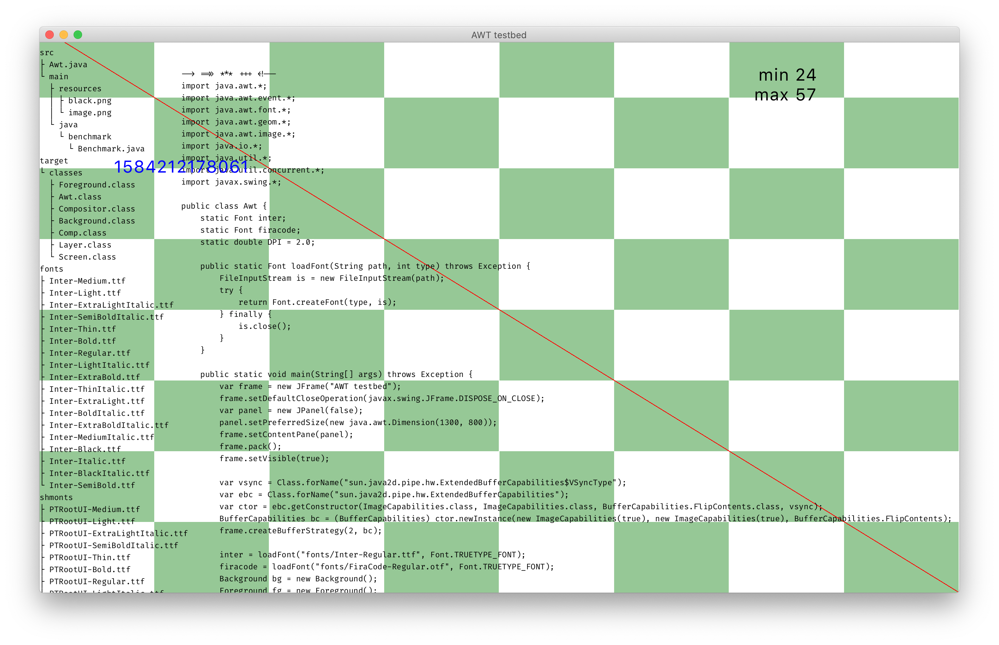
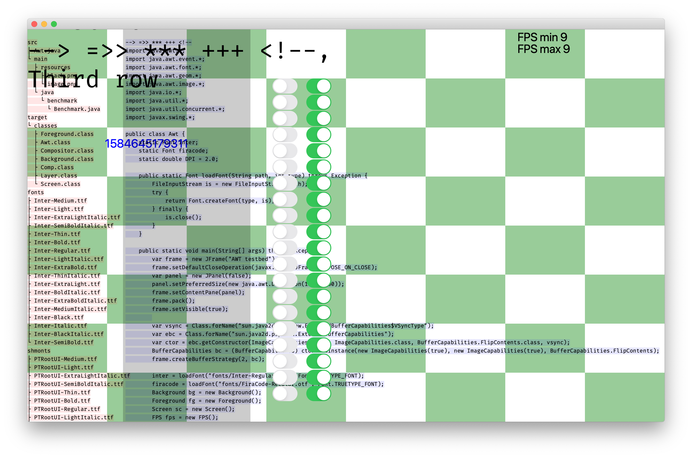

# Java Graphics benchmark

In both test I didn’t use AWT/Swing/JavaFX components/scene, but created a full-window canvas and rendered to it directly.

## AWT

```
./script/awt.sh
```



- 20-30 fps for 2600x1600 window
- Drawing 40 rounded rects ~20 fps
- Clipping 40 rounded rects ~15 fps
- No VSync
- Double buffering seems to be really expensive
- Open type is supported, but no way to control features (incl. no way to DISABLE e.g. `calt`)
- Clipping boundary is not antialiased
- No effects, e.g. shadow

## JavaFX 15

```
./script/bootstrap.sh
./script/run.sh
```



- Faster than AWT. Fill 2600x1600 window with 11pt text takes 2-3ms / frame
- VSync exists, capped at 60fps (?)
- No OpenType font features (no ligatures)
- No way to reuse text layout (+measures) when later rendering same text to canvas
- Drawing 32x DropShadow effects drops fps to ~30 fps
- Single rounded rect clip drops fps to ~30
- 40 rounded rect clips drop fps to ~10
- LCD font smoothing seems to be very bad

## Test machine

```
3,2 GHz 6-Core Intel Core i7
Intel UHD Graphics 630 1536 MB
3840x2160 @ 60Hz
MacOS 10.15.3
```